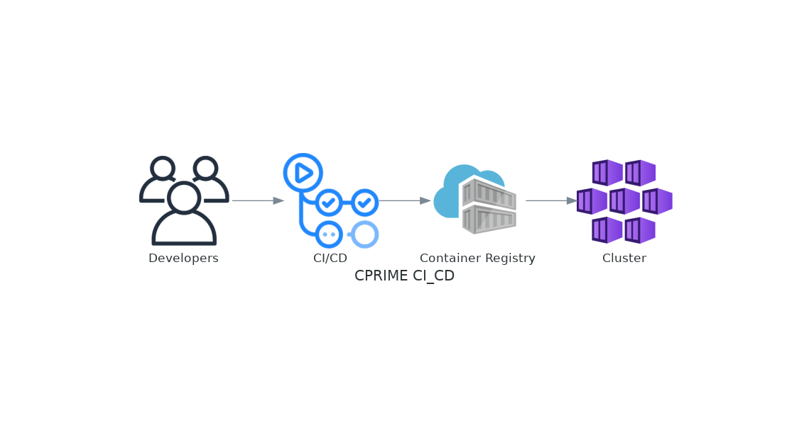

# cprime_cicd

# Create a resource group
az group create --name cprime-rg --location eastus

# Create a container registry
az acr create --resource-group cprime-rg --name cprimecontainerregistry --sku Basic

# Create a Kubernetes cluster
az aks create --resource-group cprime-rg --name cprime-cluster --node-count 2 --enable-addons monitoring --generate-ssh-keys

# Clean up
az group delete --name cprime-rg

# AKS Cluster access from local:

az aks get-credentials --resource-group cprime-rg --name cprime-cluster
Merged "cprime-cluster" as current context in /home/ramachandrank/.kube/config

kubectl get nodes

# Create Admin Username & Password:
Enable Admin User on ACR:
• Go to the Azure portal.
• Navigate to your ACR instance.
• Under ‘Settings’, select ‘Access keys’.
Enable the ‘Admin user’. This will generate a username and password for your registry1.

env:
ACR_USERNAME:${{secrets.ACR_USERNAME}}
ACR_PASSWORD:${{secrets.ACR_PASSWORD}}

# Create Service Principal (Optional): 
If you prefer not to use the admin user, you can create a service principal with access to your container registry:

az ad sp create-for-rbac --name <service-principal-name> --scopes <acr-resource-id> --role acrpush

# AZURE Credentials

Create a Service Principal: Open Azure Cloud Shell or use Azure CLI locally and run the following command to create a new Service Principal. This command will output a JSON object with your new Service Principal’s credentials.
az ad sp create-for-rbac --name "cprime-cluster-sp" --role "contributor" --scopes /subscriptions/<Sub-ID> --sdk-auth

AZURE_CREDENTIALS: ${{secrets.AZURE_CREDENTIALS}}