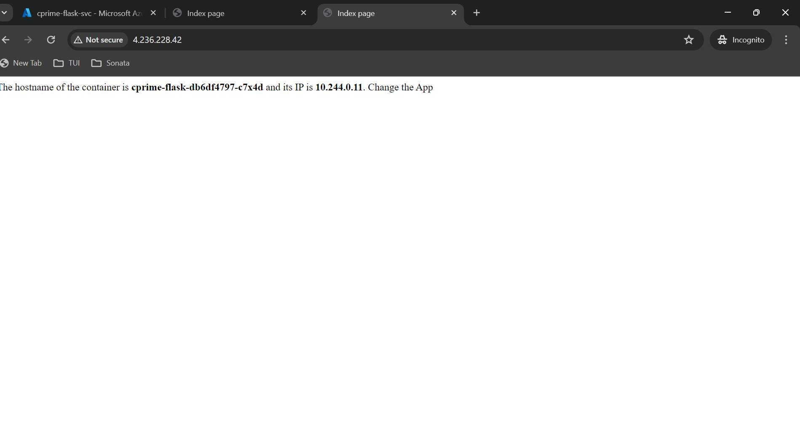

# CPRIME - DEVOPS - EXERCISE
# Repository Overview
This GitHub repository is structured to facilitate DevOps practices for a sample Python-Flask application. It includes the following components:

- **Sample Python-Flask Application**: Demonstrates containerization by displaying the container name and IP address.
- **Dockerfile**: Provides instructions for building a Docker image of the application.
    > This Dockerfile is designed to build a Docker image for a Python application. It follows best practices for creating lightweight and secure container images.
        The Dockerfile specifies `python:${PYTHON_VERSION}-slim` as the base image, which is a slim variant of the official Python Docker image with the specified Python version (`3.10.12`). The slim variant is chosen to reduce the size of the image.
        Two environment variables are set:
            - `PYTHONDONTWRITEBYTECODE`: Prevents Python from writing `.pyc` files, which are unnecessary in a Docker container.
            - `PYTHONUNBUFFERED`: Ensures that Python output is sent directly to the terminal without being buffered, which is useful for logging.
        The working directory is set to `/app`, which is where the application code will reside within the container.
        For security, a non-privileged user named `appuser` is created with a specified UID (`10001`). This user does not have a home directory, cannot log in, and does not have a password. The application will run as this user.
        Dependencies are installed using `pip` with a cache mount to `/root/.cache/pip` to speed up builds by reusing the cached layers. A bind mount is used for `requirements.txt` to avoid copying it into the layer.
        The application code is copied into the container with the `COPY . .` instruction.
        The Dockerfile exposes port `8080`, which is the port that the application listens on.
        Finally, the command to run the application is specified with `CMD python3 app.py`, which will be executed when the container starts.
        This Dockerfile is optimized for caching, security, and minimal image size, making it suitable for production deployments of Python applications.
- **Terraform Scripts**: A collection of scripts to provision an Azure Kubernetes Service (AKS) cluster infrastructure. These scripts are intended for one-time execution.
    > This Terraform script is designed to provision Azure resources for deploying a containerized application. It defines three main resources: a resource group, a container registry, and a Kubernetes cluster.
    The `azurerm_resource_group` resource defines an Azure Resource Group, which is a container that holds related resources for an Azure solution. The name and location of the resource group are specified by variables, allowing for easy customization.
    `
        resource "azurerm_resource_group" "cprime_rg" {
        name     = var.resource_group
        location = var.resource_group_location
        }
    `
    The azurerm_container_registry resource creates an Azure Container Registry (ACR), which is a managed Docker registry service for storing and managing container images. The registry is placed within the previously defined resource group and its SKU, name, and admin user status are controlled by variables.
    `resource "azurerm_container_registry" "cprime_acr" {
        name                = var.container_registry_name
        resource_group_name = azurerm_resource_group.cprime_rg.name
        location            = azurerm_resource_group.cprime_rg.location
        sku                 = var.container_registry_sku_name
        admin_enabled       = var.container_registry_admin_enabled
    }
    `
    The azurerm_kubernetes_cluster resource provisions an Azure Kubernetes Service (AKS) cluster. The cluster’s name, location, DNS prefix, and version are specified by variables or hardcoded values. The depends_on attribute ensures that the resource group and container registry are created before the Kubernetes cluster.
    The default node pool configuration, including the name, count, and VM size of the nodes, is also specified through variables. The cluster is assigned a system-assigned managed identity for Azure resources.
    `resource "azurerm_kubernetes_cluster" "cprime_cluster" {
    name                = var.cluster_name
    location            = azurerm_resource_group.cprime_rg.location
    resource_group_name = azurerm_resource_group.cprime_rg.name
    dns_prefix          = var.cluster_dns_prefix
    kubernetes_version  = "1.28.5"
    depends_on = [azurerm_resource_group.cprime_rg, azurerm_container_registry.cprime_acr]
    default_node_pool {
        name       = var.node_pool_name
        node_count = var.node_count
        vm_size    = var.vm_size
    }
    identity {
        type = "SystemAssigned"
    }
    }
    `

- **Kubernetes Manifest Files**: Contains the necessary files to deploy the application and its services on AKS.
- **CI/CD Workflow Files**: Located under the .github/workflows directory, these files define the GitHub Actions workflows for continuous integration and continuous deployment of the application:
    - aks_deploy.yaml
    - terraform.yaml
# Sample Application
The sample application is containerized for easy deployment and scaling within Kubernetes environments.

# CI/CD 


# Sample Web Application


# AKS Cluster Creation with Terraform
Terraform scripts for creating the AKS cluster are located in the infra/aks directory. The ci.yaml workflow automates the creation of the AKS cluster and associated resources within the Azure portal.

# Secrets and Variables Settings
The following table outlines the secrets and variables required for the workflows, along with their respective placeholders:

| Secret Name | Secret Value | Comments |
|-------------|--------------|----------|
|ACR_USERNAME|${{ secrets.ACR_USERNAME }}|Azure Container Registry Admin username|
|ACR_PASSWORD|${{ secrets.ACR_PASSWORD }}|Azure Container Registry password|
|AZURE_CREDENTIALS|${{ secrets.AZURE_CREDENTIALS }}|Azure service principal credentials|
|ARM_CLIENT_ID|${{ secrets.ARM_CLIENT_ID }}|Azure service principal client ID|
|ARM_CLIENT_SECRET|${{ secrets.ARM_CLIENT_SECRET }}|Azure service principal client secret|
|ARM_SUBSCRIPTION_ID|${{ secrets.ARM_SUBSCRIPTION_ID }}|Azure subscription ID|
|ARM_TENANT_ID|${{ secrets.ARM_TENANT_ID }}|Azure tenant ID|
# AKS Cluster Creation using Azure CLI
The following commands are used to create and manage the AKS cluster via the Azure CLI:

# Create a Resource Group
```sh
az group create --name cprime-rg --location eastus
```
# Create a Container Registry
```sh
az acr create --resource-group cprime-rg --name cprimecontainerregistry --sku Basic
```
# Create a Kubernetes Cluster
```sh
az aks create --resource-group cprime-rg --name cprime-cluster --node-count 2 --enable-addons monitoring --generate-ssh-keys
```
# Clean Up Resources
```sh
az group delete --name cprime-rg
```
# Access AKS Cluster from Local Machine
```sh
az aks get-credentials --resource-group cprime-rg --name cprime-cluster
```
> Ensure that all placeholders are replaced with actual values before executing the commands or workflows. The repository is designed to streamline the development and operations lifecycle of the sample application through automation and best practices in cloud-native deployment.